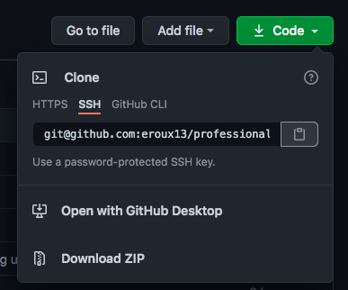
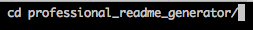
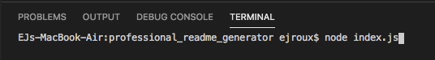
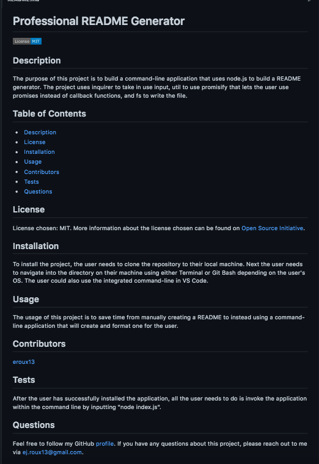

# Professional README Generator

## Description

The purpose of this project is to build a command-line application that uses node.js to build a README generator. The project uses inquirer to take in user input, util to use promisify that lets the user use promises instead of callback functions, and fs to write the file.

[Full Video Walkthrough](https://drive.google.com/file/d/1E8DHLWNlT_jxd4IcTebaC-ah8qcHRi5w/view)

## Table of Contents

* [Description](#description)
* [License](#license)
* [Installation](#installation)
* [Usage](#usage)
* [Contributors](#contributors)
* [Tests](#tests)
* [Questions](#questions)
    
## License

License chosen: MIT.
More information about the license chosen can be found on [Open Source Initiative](https://opensource.org/licenses/MIT).
    
## Installation

To install the project, the user needs to clone the repository to their local machine. 

Next the user needs to navigate into the directory on their machine using either Terminal or Git Bash depending on the user's OS. The user could also use the integrated command-line in VS Code.

## Usage

The usage of this project is to save time from manually creating a README to instead using a command-line application that will create and format one for the user.

## Contributors

[eroux13](https://www.github.com/eroux13)

## Tests

After the user has successfully installed the application, all the user needs to do is invoke the application within the command line by inputting `node index.js`.

## Questions

Feel free to follow my GitHub [profile](https://www.github.com/eroux13).
If you have any questions about this project, please reach out to me via ej.roux13@gmail.com.

## Generated Sample

Here is an example of a successfully generated README.md from using this project!

